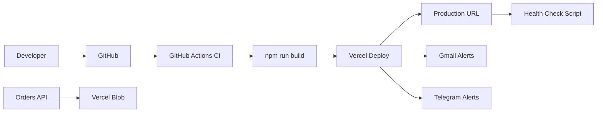

# E-Commerce DevOps Pipeline

[](https://github.com/features/actions)
[](https://vercel.com)
[](https://www.docker.com)

End-to-end **DevOps setup** for the [Vaha Ruchulu e-commerce platform](https://github.com/SAIKIRAN0035/e-commerce-website) — from zero to production CI/CD, environment management, health checks, and incident runbooks.

**Live site this pipeline supports:** https://vaha-ruchulu.vercel.app

---

## What this project covers

| Phase | Topic | Doc |
|-------|--------|-----|
| 1 | Planning & goals | [docs/01-planning.md](docs/01-planning.md) |
| 2 | Repository & branching | [docs/02-repository-setup.md](docs/02-repository-setup.md) |
| 3 | CI — build & lint | [docs/03-ci-pipeline.md](docs/03-ci-pipeline.md) |
| 4 | CD — Vercel production | [docs/04-cd-vercel.md](docs/04-cd-vercel.md) |
| 5 | Secrets & environments | [docs/05-secrets-and-env.md](docs/05-secrets-and-env.md) |
| 6 | Monitoring & alerts | [docs/06-monitoring-alerts.md](docs/06-monitoring-alerts.md) |
| 7 | Rollback & troubleshooting | [docs/07-rollback-troubleshooting.md](docs/07-rollback-troubleshooting.md) |

---

## Architecture



---

## Quick start

```bash
git clone https://github.com/SAIKIRAN0035/ecommerce-devops-pipeline.git
cd ecommerce-devops-pipeline

# Run health check against production
./scripts/health-check.sh

# Local Docker parity (static build preview)
docker compose up --build
```

---

## Repository layout

```
.github/workflows/   # CI workflows (lint, build, health)
docker/              # Dockerfile for local preview
scripts/             # health-check, deploy helpers
docs/                # Step-by-step DevOps journey (01–07)
```

---

## Tech stack

- **CI/CD:** GitHub Actions, Vercel CLI
- **Hosting:** Vercel (serverless + edge)
- **Storage:** Vercel Blob
- **Alerts:** Gmail SMTP, Telegram Bot API
- **Containers:** Docker (local dev parity)

---

## Author

**Saikiran Reddy Yarava** · [GitHub](https://github.com/SAIKIRAN0035) · [E-commerce app](https://github.com/SAIKIRAN0035/e-commerce-website)
